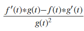
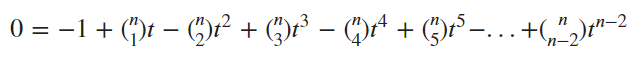
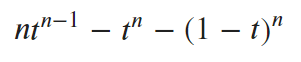

### Viewing the Circulant and its Determinant Derivative

After finding examples where the inequality can be negative, indicating that the inverse diagonal values do not always increase through the domain t = [0, 1/2], we looked for the most extreme example that results in a negative inequality. Since the trend for negative inequalities seemed to be 0s on the diagonal and a large value on the off diagonal, the most extreme example seemed to be the circulant matrix. The circulant matrix has a 1 on the off diagonal and 0s on the diagonals. Below are examples of the n = 2 through n = 4 circulant matrices:

| Size of Matrix | Example Circulant Matrix |
| ------------- | ---------- |
| 2 | |
| 3 | |
| 4 | | 

Using the circulant at each size as the A matrix, I ran it through the convex combination with the identity and looked at the inverse diagonal values at each t. The results of the diagonals are displayed in graphs from n = 2 to n = 10:

| Size of Matrix | Graph of Inverse Diagonal Values | 
| ------------- | ------------ |
| 2 | |
| 3 | |
| 4 | |
| 5 | |
| 6 | |
| 7 | |
| 8 | |
| 9 | |
| 10 | |

Based on the graphs, the derivative changes from positive to negative in the odd size matrices while there is no change over in the even circulant matrices. Additionally, the turnover point in the odd size matrices occurs at a larger t for larger sized matrices. For example, the turnover point for the 3x3 matrix occurs around 1/3 while the turnover for the 9x9 matrix is closer to .41. For a more exact view of where the turnover occurs, we can find the derivative for the diagonal values using the determinant expression we've used throughout the project. In order to use the expression, we denote the circulant as the A matrix and calculate from there. In the determinant expression, we called the numerator f(t) and the denominator as g(t). This new expression was for ease of use with the quotient rule of the derivative. The expression is as such:

With this new notation, we can calculate f(t) and g(t) for the circulant example and view if there is a pattern that arises. By viewing the 2x2 to 5x5 examples, the pattern became clear, and we were able to denote the nxn case of the expression. Below are the results: 

| Size of Matrix (n) | f(t) | g(t) |
| ------- | ------- | ------ |
| n |  |  |
| 2 |  |  |
| 3 |  |  |
| 4 |  |  | 
| 5 |  |  |

Once we had the expressions for f(t) and g(t), we were able to take their derivatives so that we can plug their values into the whole quotient expression. Below are the derivatives of f(t) and g(t), expressed as f'(t) and g'(t) respectively, for the nxn case as well as n = [2,5]:

| Size of Matrix (n) | f'(t) | g'(t) |
| ------- | ------- | ------ |
| n |  |  |
| 2 |  |  |
| 3 |  |  |
| 4 |  |  | 
| 5 |  |  |  

With these values, we can plug into the quotient rule which states that the derivative where f(t) is the numerator and g(t) is the denominator is equal to:

Since we are only interested in when the derivative is equal to 0, indicating where the derivative begins to change in sign, we can remove the denominator and look solely at the numerator. In that case, the numerator of the derivative for the nxn case is:

Setting the numerator equal to zero gives the t where the derivative is 0. This is the t where the diagonal values stop increasing and transition into a decreasing state like we saw in the graphs. For the general nxn case, the polynomial to solve where the derivative for the inverse diagonal values of the circulant equals 0 is:

Using this equation, we are able to calculate the highest t we can use in the interval t = [0, 1/2] and still have increasing inverse diagonal values. 

We are able to simplify this polynomial even more. Below is the simplified polynomial for when n is even vs when n is even.

| Odd n Expression | Even n Expression |
| ---------------- | ---------------- |
|  |  |

For odd n, below are the t where the derivative is zero and up to which the derivative is positive. For these examples, the t represents the new bound up to which the inverse diagonal values are increasing. Each number is rounded to 4 decimal places but the exact value can be found by solving the equation above for t when equal to 0.

| Size of Matrix | Value of t where Derivative is 0 |
| -------------- | --------------- |
| 3 | 1/3 |
| 5 | .3772 |
| 7 | .4013 |
| 9 | .4168 |
| 11 | .4276 |
| 13 | .4358 |
| 15 | .4420 |

### View the code

### Navigate to Other Pages

[Return to the home page](README.md)

[View definitions of symbols used in the project](definitions.md)  