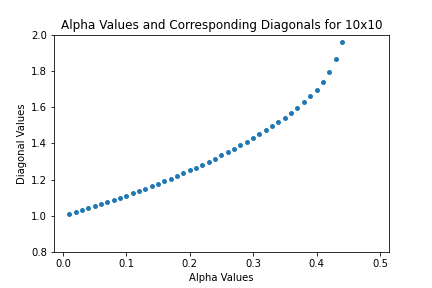

### Viewing the Circulant

After finding out that the inequality can be negative, indicating that the inverse diagonal values do not always increase through the domain t = [0, 1/2], we looked for the most extreme version that results in a negative inequality. Since the trend seemed to be 0s on the diagonal and a large value on the off diagonal, the most extreme example seemed to be the circulant matrix. The circulant matrix has a 1 on the off diagonal and 0s on the diagonals. Below are examples of the n = 2 through n = 4 circulant matrices:

| Size of Matrix | Example Circulant Matrix |
| ------------- | ---------- |
| 2 | |
| 3 | |
| 4 | | 

Using the circulant at each size as the A matrix, I ran it through the convex combination with the identity and looked at the inverse diagonal values at each t. The results of the diagonals are displayed in graphs from n = 2 to n = 10:

| Size of Matrix | Graph of Inverse Diagonal Values | 
| ------------- | ------------ |
| 2 | |
| 3 | |
| 4 | |
| 5 | |
| 6 | |
| 7 | |
| 8 | |
| 9 | |
| 10 | |

Based on the graphs, the derivative changes from positive to negative in the odd size matrices while there is no change in the even circulant matrix. Additionally, the turnover point in the odd size matrices occurs at a larger t for larger sized matrices. For example, the turnover point for the 3x3 matrix occurs around 1/3 while the turnover for the 9x9 matrix is closer to .41. For a more exact view of where the turnover occurs, we can find the derivative for the diagonal values using the determinant expression we've used throughout the project using the circulant as the A matrix:

From here, we can calculate what f(t) and g(t) come out as. By viewing the 2x2 to 5x5 examples, the pattern became clear. 

| Size of Matrix (n) | f(t) | g(t) |
| ------- | ------- | ------ |
| n |  |  |
| 2 |  |  |
| 3 |  |  |
| 4 |  |  | 
| 5 |  |  |

Once we had the f(t) and g(t), we took their derivatives to take the derivative  of the whole expression:

| Size of Matrix (n) | f(t)' | g(t)' |
| ------- | ------- | ------ |
| n |  |  |
| 2 |  |  |
| 3 |  |  |
| 4 |  |  | 
| 5 |  |  |  

Putting it together, the numerator of the total derivative for the nxn case is:

Setting the numerator equal to zero gives the t where the derivative is 0 and the diagonal values start to decrease with increasing t for the circulant. 

### View the code

### Navigate to Other Pages
[Go to the next page: Other Miscellaneous Findings](misc_observations.md)

[Return to home page](README.md)

[View definitions of symbols used in the project](definitions.md)  