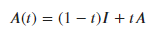
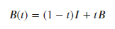

### Definitions of Symbols used Throughout the Project

**A** : The nxn row stochastic matrix before averaging with the identity.

**A(t)**: The nxn matrix produced by the convex combination of the identity and the A matrix.

**B** : The (n-1)x(n-1) principle sub matrix made by removing the first row and column of the A matrix.

**B(t)**: The (n-1)x(n-1) matrix produced by the convex combination of the identity of the B matrix.

**μ** : An eigenvalue from the B matrix before the convex combination with the identity.

**μ(t)** : An eigenvalue from the B(t) matrix after the convex combination with the identity.

**λ** : An eigenvalue from the A matrix before the convex combination with the identity.

**λ(t)** : An eigenvalue from the A(t) matrix after the convex combination with the identity.

**f(t)** : The numerator of the determinant expression

**g(t)** : The denominator of the determinant expression.

**G(t)** : An example function to help illustrate the inequality simplification. Not representative of an actual function used in the project.

### Navigate to other pages

[Return to the home page](README.md)   