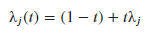

### Definitions of symbols used throughout the project

**A** : The nxn row stochastic matrix before averaging with the identity.

**A(t)**: The nxn matrix produced by the convex combination of the identity and the A matrix.

**B** : The (n-1)x(n-1) principle sub matrix made by removing the first row and column of the A matrix.

**B(t)**: The (n-1)x(n-1) matrix produced by the convex combination of the identity of the B matrix.

**μ** : An eigenvalue from the B matrix before the convex combination with the identity.

**μ(t)** : An eigenvalue from the B(t) matrix after the convex combination with the identity.

**λ** : An eigenvalue from the A matrix before the convex combination with the identity.

**λ(t)** : An eigenvalue from the A(t) matrix after the convex combination with the identity.

