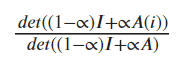
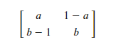
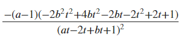
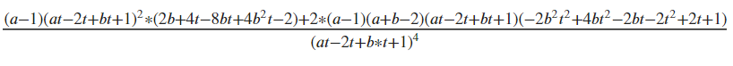
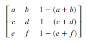

## Derivatives of the Inverse Diagonal Values
After seeing that the diagonal values of the inverse appear to be increasing with increases in t, we moved on to supporting that finding analytically with the derivative. The diagonal values of a matrix can be expressed by the equation below:

This expression comes from the book "Matrix Analysis" by Horn & Johnson (2013). Det stands for the determinant of the resulting matrices. A(i) represents the matrix A without column and row i. This means that A(i) has one less row and column than A, making it a (n-1) x (n-1) matrix. i stands for the given diagonal value of the inverse that the equation is solving for. For example, if solving for the (1,1) entry of the inverse matrix, i equals 1 and the A(1) matrix would be A without the first row and column. Solving for the (2,2) entry would look at A(2) which removes the second row and column from A. The process continues for each diagonal value of the inverse. Knowing this expression, we were able to apply it to calculate the derivative of the diagonal values in relation to t. To start, we looked at the 2x2 case for a simple beginning. Using Matlab and hand calculations, we found the first and second derivative for the 2x2 case. Both are provided below alongside the theoretical row stochastic matrix as a frame of reference for the variables.

### 2x2 Matrix

The Matrix:

First Derivative:

Above is the first derivative for the 2x2 inverse of the row stochastic diagonally dominant matrix. By analysis, the first derivative appears to be positive in all instances, indicating an increase in the diagonal values as t increases. This is consistent with our findings that the inverse diagonal values in the previous section were increasing and provides confidence that our finding is correct.

Second Derivative:

Above is the second derivative for the diagonal values of the 2x2 inverse. The second derivative adds more complexity than the first derivative, involving many more terms. Using simulations with varying a and b values ranging from 0 to 1, and t values from 0 to 1/2, we were able to show that the second derivative is consistently positive for the 2x2 case. This further supports the thought that the diagonal values of the inverse are always increasing as t increases. 

### 3x3 Matrix

The Matrix:

First Derivative:

Above is the first derivative of the diagonal values of the inverse for the 3x3 matrix. The complexity increased dramatically, and the increase in variables made it much harder to evaluate this derivative in an analytical or computation manner. For this reason, we were unable to solve if the derivative was positive for each t in the same we were able to with the n = 2 case. To counteract that, we needed to look for an alternative perspective on the derivative.

## Results and Next Steps
As a result of the increasing complexity of the derivatives, we shifted our focus away from trying to illustrate the phenomenon with this perspective of the derivative because it would be too complicated to show for larger sizes in a consistent manner. With this in mind, we did not shift entirely away from the determinant method for finding the diagonal values of the inverse, however. The determinant expression proved useful throughout the project as insight on what is happening to the inverse diagonal values.

### View the Code

[Matlab script for finding the derivatives and testing them for positivity](code_files/looking_at_determinant_derivatives.m)

### Navigate to Other Pages

[Go to next page: Viewing the inverse diagonal entries using eigenvalues](eigenvalue_findings.md)

[Return to the home page](README.md)

[View definitions of symbols used in the project](definitions.md)

