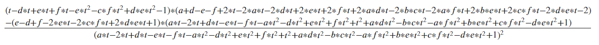

## Derivitives of the Inverse Diagonal Values
After showing that the diagonal values of the inverse are increasing with increases in alpha, we moved on to supporting the finding with the derivitive. The diagonal values of a matrix can be expressed by the equation below:

Det stands for the determinant of the resulting matrices. A(i) represents the matrix A without the column and row i. This means that A(i) has one less row and column than A. i stands for the given diagonal value of the inverse that the equation is solving for. For example, if solving for the (1,1) entry of the inverse matrix, i equals 1 and the A(1) matrix would be A without the first row and column. The process continues for each diagonal value of the inverse. Knowing this expression, we were able to apply it to calculate the derivative of the diagonal values in relation to the alpha value. To start, we looked at the 2x2 case for a simpler start. Using Matlab and hand calculations, we found the first and second derivative for the 2x2 case. Both are provided below alongside the theoretical row stochastic matrix as a frame of reference. In the equations shown below, t represents the same variable as alpha, ∝. The change for this example was for ease of legibility due to a being a variable as well. 

### 2x2 Matrix

The Matrix:

First Derivative:

Above is the first derivative for the 2x2 inverse of the row stochastic diagonally dominant matrix. By analysis, the first derivitive appears to be positive in all instances, indicating an increase in the diagonal values as alpha, or in this equation t, increases. This is consistent in our findings with the diagonal values in the previous section. 

Second Derivative:

### 3x3 Matrix

The Matrix:

First Derivitive:

