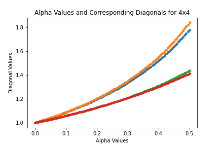
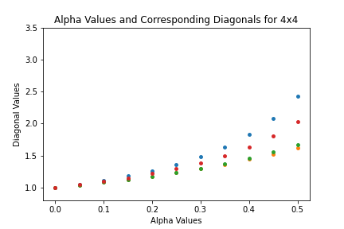
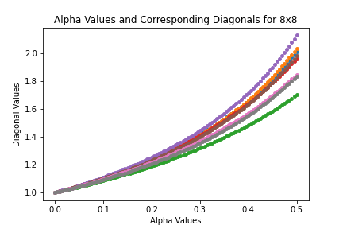
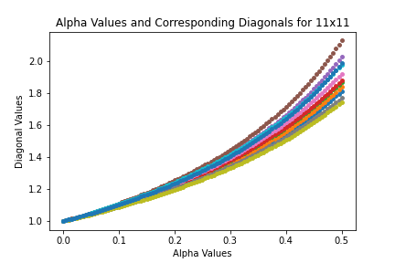

## Initial Findings of Matrices from 2x2 to 30x30

### Procedure
To investigate the trends of the aforementioned matrix, I used Matlab to create random, square, row stochastic matrices of varying sizes. The matrices were made row stochastic by dividing the rows by their row sums. The matrices were of sizes ranging from 2x2 to 30x30. I created 30 matrices for each size, resulting in 900 total starting matrices. These matrices were designated as A and put in the equation (∝*A + (1-∝)*I) where I is the identity and ∝ is a value from 0 to 0.5. Each matrix, A, was put in the equation with alpha going from 0 to 0.5 in increments of .05. The resulting matrices of the equation at each value of alpha were inverted and the diagonal values stored. The diagonal values were then graphed in scatter plots for analysis (several examples can be seen below). The scatter plots have the alpha value on the x-axis and the diagonal value on the y-axis. Moving to the right in the graph represents the alpha value increasing. Each color of dots and generated line in the scatter plot represents the diagonal value of one column of the matrix at each step of alpha. This is why there are two lines for the 2x2 matrix, 3 for the 3x3, and so on. Each color of dots and line represents the diagonal value of one column as they change with the different values of alpha. The results shown in a graph are based on one matrix A as it creates different matrices with many alpha values. The results are consistent with previous analysis of diagonally dominant row stochastic matrices. Charles Johnson and his peers proved that the diagonal values of the inverse of these matrices is greater than or equal to 1 in their paper "Diagonal Entries of Inverses of Diagonally Dominant Matrices" (I NEED TO HAVE A SOURCE HERE). The graphs shown below illustrate this clearly as they start at 1 and appear to increase as alpha increases.

The major finding of these experiments is that an increase in alpha appears to result in an increase in the diagonal values of the inverse. The diagonal values of each column do not appear to increase all at the same rate, but they do all appear to increase. As the size of the matrices increase, the variability in diagonal values from column to column as well as in the rate at which they increase seem s to decrease. The diagonal values of the columns appear to draw closer together as the size of the matrix increases. This differs from the smaller sized matrices which can have a wide range of difference between the diagonal value of one column compared to the next.  

### Findings and Graphs

| Size of the Matrix | Graphs without y-axis limit | Graph with y-axis limit |
| ------ | --------- | ------- |
| 2x2 | |  | 
| 3x3 | | | 
| 4x4 | | | 
| 5x5 | | | 
| 6x6 | | | 
| 7x7 | | | 
| 8x8 | | | 
| 9x9 | | | 
| 10x10 | | | 
| 11x11 | | | 
| 12x12 | | | 
| 13x13 | | |
| 14x14 | | | 
| 15x15 | | |

### View the code
[View the Matlab script used to generate the results](code_files/initial_diagonal_value_findings.m)

[View the Python script used to graph and analyze the results](displaying_initial_results.py)

[Return to home page](README.md)