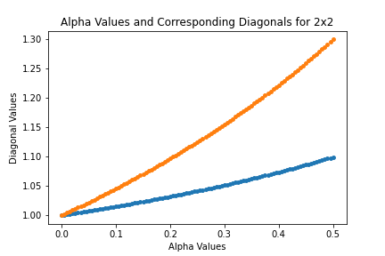
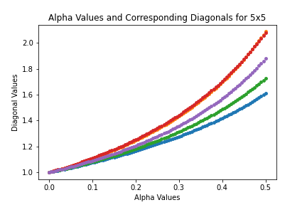
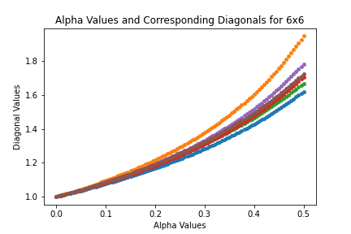
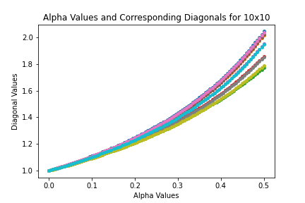

## Diagonal Values of the Inverse Matrices from 2x2 to 30x30

### Procedure
To investigate the trends of the inverse diagonal values, I used Matlab to create random square row stochastic matrices of varying sizes. After creating a random matrix, I divided each row by its row-sum to ensure row stochasticity. The matrices were of sizes 2x2 to 30x30. I created 30 matrices for each size, resulting in 900 total starting A matrices. These A matrices were put in the equation ((1-t)*I + t*A) where I is the identity and t is a value from 0 to 0.5. Each matrix, A, was put in the equation with t going from 0 to 0.5 in increments of .05. The resulting matrices of the equation at each value of t, denoted A(t), were inverted and the diagonal values stored. The diagonal values were then graphed in scatter plots for analysis and are shown below. The scatter plots have the t value on the x-axis and the corresponding diagonal value of a row on the y-axis. Moving to the right in the graph represents the t value increasing. Each color line or dot in the scatter plot represents the diagonal value of one column of the matrix at a given step of t. This is why there are two lines for the 2x2 matrix, 3 for the 3x3, and so on. Each color line or dot represents the diagonal value of one column as they change with the different values of t. The results shown in the graphs are the diagonal values of A(t), the matrix created by the convex combination of the matrix A and the identity matrix with many t values. The results are consistent with previous analysis of diagonally dominant row stochastic matrices. Charles Johnson et al. showed that the diagonal values of the inverse of these matrices is greater than or equal to 1 in their paper "Diagonal Entries of Inverses of Diagonally Dominant Matrices" (2022). The graphs shown below illustrate this clearly as the diagonal values start at 1 and appear to increase as t increases.

### Findings and Takeaways

The major finding of these experiments is that an increase in t appears to result in an increase in the inverse diagonal values for most A matrices. The diagonal values of each column do not appear to increase at the same rate, but they appear to generally increase. As the size of the matrices increase, the variability in diagonal values from column to column as well as in the rate at which they increase seems to decrease. The diagonal values of the columns appear to draw closer together as the size of the matrix increases. This differs from the smaller sized matrices which can have a wide range of difference between the diagonal value of one column compared to the next. With these observations, it is important to check if the inverse diagonal values are increasing at every t value as well as for every size. To check this, we went on to look at the derivative of the inverse diagonal values in the next section.

### Graphs of the findings

Below are the various graphs of the inverse diagonal values. The table is formatted so that the size of the matrix is denoted on the far left. The middle column contains graphs where the y-axis scale is variable. This is to show the differences on a more micro level between the columns of that particular matrix. In the far right column are matrices that have a consistent y-axis scale. This is for a more macro-level analysis and to compare evenly across the different sized matrices. The alpha term shown on the x-axis is the same as the t value discussed above. The two are interchangeable throughout the project. The main takeaway from the graphs is the apparent uniform increase in the inverse diagonal values. In the next section, we look at the derivative of these values and if they are increasing at all values of t and n. The graphs shown below range from n = 2 to n = 15. This is because the trends beyond 15 were consistent with the general findings in the n = 10 to n = 15 range. All continued to increase and were tightly grouped together.

| Size of the Matrix | Graphs without y-axis limit | Graph with y-axis limit |
| ------ | --------- | ------- |
| 2x2 | |  | 
| 3x3 | | | 
| 4x4 | | | 
| 5x5 | | | 
| 6x6 | | | 
| 7x7 | | | 
| 8x8 | | | 
| 9x9 | | | 
| 10x10 | | | 
| 11x11 | | | 
| 12x12 | | | 
| 13x13 | | |
| 14x14 | | | 
| 15x15 | | |

### View the code
[View the Matlab script used to generate the inverse diagonal values](code_files/initial_diagonal_value_findings.m)

[View the Python script used to graph and analyze the inverse diagonal values](code_files/displaying_inverse_diagonal_values.py)

### Navigate to Other Pages
[Go to the next page: Derivatives of the inverse diagonal values using the determinant expression](derivitives_findings.md)

[Return to the home page](README.md)

[View definitions of symbols used in the project](definitions.md)