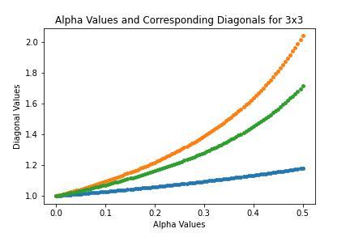
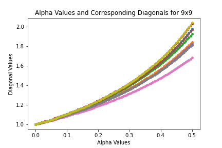
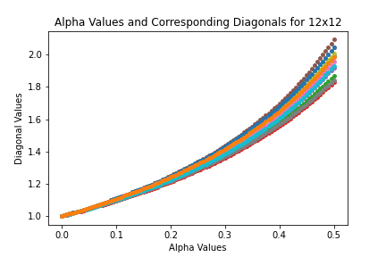

## Initial Findings of Matrices from 2x2 to 15x15

### Procedure
To investigate the trends of the aforementioned matrix, I used Matlab to create random, square, row stochastic matrices of varying sizes. The matrices were of sizes ranging from 2x2 to 30x30. I created 15 matrices for each size, resulting in 450 total starting matrices. These matrices were designated as A and put in the equation (∝*A + (1-∝)*I) where I is the identity and ∝ is a value from 0 to 1/2. Each matrix, A, was put in the equation with ∝ going from 0 to 1/2 in increments of .05. The resulting matrices of the equation at each value of ∝ were inverted and the diagonal values stored. The diagonal values were then graphed in scatter plots for analysis (several examples can be seen below). The scatter plots have the ∝ value on the x axis and the diagonal value on the y axis. Moving to the right in the graph represents the ∝ value increasing. Each color of dots and generated line in the scatter plot represents the diagonal value of one column of the matrix at each step of ∝. This is why there are two lines for the 2x2 matrix, 3 for the 3x3, and so on. Each color of dots and line represents the diagonal value of one column as they change with the different values of ∝. The results shown in a graph are based on one matrix A as it creates different matrices with many ∝ values. The results are consistent with previous analysis of diagonally dominant row stochastic matrices. Charles Johnson and his peers proved that the diagonal values of the inverse of these matrices is greater than or equal to one (I NEED TO HAVE A SOURCE HERE). The graphs illustrate this clearly as they start at 1 and increase as ∝ increases.

The major finding of these experiments is that an increase in alpha results in an increase in the diagonal values of the inverse. The diagonal values do not appear to always increase at the same rate as the other columns but they do all increase. As the size of the matrices increase, the variability in diagonal values from column to column as well as in the rate at which they increase decreases. The diagonal values of the columns appear to draw closer together as the size of the matrix increases. 

### Findings and Graphs

### View the code
[View the Matlab script used to generate the results](initial_findings.m)

[View the Python script used to graph and analyze the results](displaying_initial_results.py)

[Return to home page](README.md)