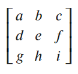
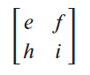
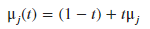
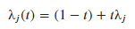
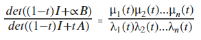
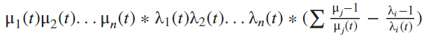

## Analyzing the Eigenvalues of the Inverse and its Principle Sub Matrix

After looking at the derivative of the diagonal values of the inverse, we transitioned to looking at its eigenvalues and their relation to its principle sub matrix. The principle sub matrix of the inverse is denoted as B. This is the same as the A(i) term found in the previous section and its equation with the determinants. By exchanging A(i) with B, the determinant expression for the diagonal values of the inverse is given as:

B is created by removing the first row and column of the A matrix. With this concept in mind, below is a visual of an A matrix and its corresponding principle matrix, B:

| Example A Matrix | Example B Matrix|
| ----- | ----- |
| |  | 

By removing a row and column from A, B is an (n-1)x(n-1) matrix compared to a nxn that A was. Being one size smaller, B has one less eigenvalue than A. A has n eigenvalues while B has n-1. The extra eigenvalue for A is equal to 1 because A is a stochastic matrix. Being a stochastic matrix ensures one of its eigenvalues is equal to 1. Since B is sub stochastic, meaning its row sums are less than 1, it will not have 1 as its eigenvalue.

The product of a matrix's eigenvalues is the determinant. Knowing this relationship, we were able to rewrite the determinant equation above taking advantage of eigenvalues. The eigenvalues of the principle sub matrix, B, were denoted as μ; called mu. The eigenvalues of the A matrix were denoted as λ; referred to as lambda. Putting the matrix A matrix through the convex combination with the identity, ((1-∝)I + ∝A), does the same operations to the eigenvalues. For this reason, we can write mu and lambda as expressions of t:

|Mu Expression | Lambda Expression|
| ----------  | ------------ |
||  |

In these expressions of t, j denotes the jth mu eigenvalue of the B matrix and i denotes the ith lambda eigenvalue of the A matrix. If j is equal to 1, the expression would be dealing with the first eigenvalue of the B matrix. If i is equal to 5, the expression would be dealing with the fifth eigenvalue of the A matrix. With these understandings, we can change the determinant expression into one containing these eigenvalues:
                     

To the left of the equals sign is the original determinant expression for the diagonal values of the inverse. On the right is the way to express the diagonal values as the product of the eigenvalues for the B matrix divided by the product of the eigenvalues of the A matrix. Additionally, there is an equal number of eigenvalues for the numerator and denominator even though the two matrices are of different size. The equal number of eigenvalues is due to the extra eigenvalue for the A matrix being equal to 1. For this reason, multiplying the denominator by the additional eigenvalue does not change its value.

With this new perspective on finding the diagonal values of the inverse, we decided to take its derivative. This new perspective had optimism of being less complicated for bigger sizes due to the marked decrease in the number of terms in the expression. We took the derivative of the eigenvalue expression using the product and quotient rule, simplifying it to the expression:

An important distinction in the expression is that the mu and lambda values in the numerators of the summation come from the B and A matrix respectively before the convex combination with the identity. The rest of the mu and lambda values from after the convex combination. With the new derivative in hand, we ran calculations using different matrices from size 3 to 5, inputting their respective eigenvalues. Since we want to show that the diagonal values are increasing, we expect to see that the derivative is positive. For the cases we examined, this was the case. 

### Findings and Next Step

With the eigenvalues, we found a new way to express the derivative for the inverse diagonal values. Using that new derivative expression, we were able to check for positivity which we expected. With the examples we ran, we continued to see positivity throughout. This implies a continued increase in the inverse diagonal values up through t = 1/2. After this new expression, we sought a specific inequality to look at and to prove that the inverse diagonal values are increasing.

### View the Code

[Matlab script for creating, viewing, and testing the eigenvalues from generated matrices.](code_files/evaluating_eigenvalues_trends.m)

### Navigate to Other Pages
[Go to the next page: Viewing the derivative inequality](inequality_findings.md)

[Return to home page](README.md)

[View definitions of symbols used in the project](definitions.md)

