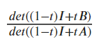

## Analyzing the Eigenvalues of the Inverse and its Minor

After looking at the derivative of the diagonal values of the inverse, we transitioned to looking at its eigenvalues and their relation its minor. The minor of the inverse is denoted as B, as seen in the previous determinant calculation for the diagonal values:

B in this instance is the same as the A(i) from the previous expression. That means that B is the resulting matrix of removing the first row and column of A. This makes B an (n-1)x(n-1)  matrix compared to an nxn matrix like A. By being a smaller matrix, that means that B has one less eigenvalue than A. The extra eigenvalue for A is 1 because it is a stochastic matrix. Since B is stochastic, it will not have 1 as its eigenvalue. Knowing that the determinant of a matrix is just the product of the eigenvalues, we were able to rewrite the determinant equation above with eigenvalues. We denoted the eigenvalues of the B matrix as μ, referred to as mu. The eigenvalues of the A matrix were denoted as λ, referred to as lambda. Putting the matrix through the convex combination with the identity, ((1-∝)I + ∝A), does the same to the eigenvalues. For this reason, we can write mu and lambda as expressions of alpha:

|Mu Expression | Lambda Expression|
| ----------  | ------------ |
||  |

In the above expressions, j denotes the jth eigenvalue of the B matrix and i denotes the ith eigenvalue of the A matrix. With these understandings, we can change the determinant expression into one containing the above eigenvalues:
                     

In the above equation, to the left of the equals sign is the determinant from the top of the page as well as from previous sections. On the right is the new way to write the same equation using the idea that the determinant is the product of the eigenvalues. Additionally, there is an equal amount of eigenvalues for the numerator or denominator of the eigenvalue quotient even though there is an extra lambda eigenvalue from the A matrix. The extra eigenvalue is missing because it equals one, keeping the expression the same even when included. 

