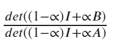
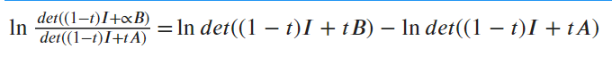
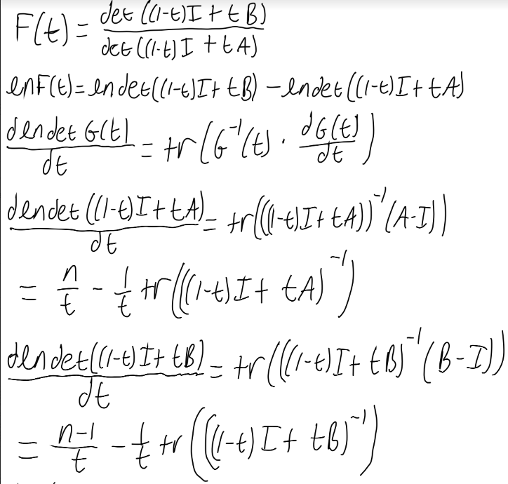
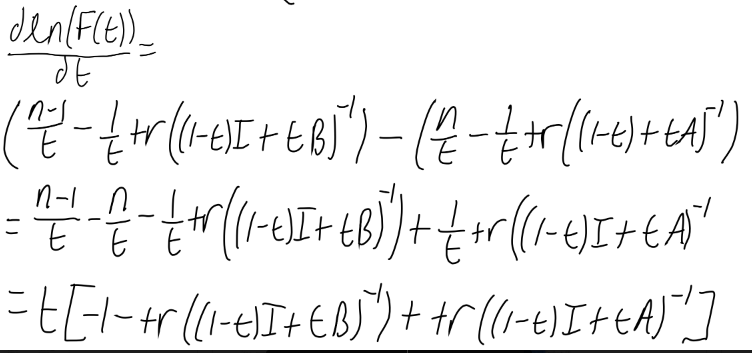
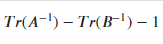
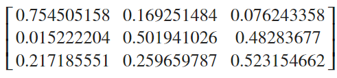

### Finding a Derivative Inequality for the Inverse Diagonal Values

Following the two approaches at the derivative of the inverse diagonal values, we sought a way to prove analytically that the values were increasing since this is what we observed for all the examples to that point. For the next step, we went back to the determinant expression: 

The determinant expression provides an equation to find a diagonal value of the inverse. With the new approach, we decided to find the derivative in a different way. First, we applied the natural log to the expression to break up the quotient: 

Once breaking the expression up, we were able to take the derivative of the new expression which came out to:

This left us with a new inequality of:

In this expression, Tr refers to the trace of the matrix in the parentheses. The trace of a matrix is the sum of its diagonal values. Since this expression retains the sign of the derivative, we can view if the expression remains positive throughout the domain of t = [0, 1/2]. Using various methods, we arranged the expression in hopes of finding a proof. Once we were stuck, I looked to test the inequality with a larger sample size, trying to find if maybe it was not true that the inequality was positive for the whole domain of t. With these tests, I did 10 trials. Each trial looked at matrices from n = 2 to n = 30. For each size matrix, I ran 1000 A matrices before convex combination. Each A matrix had t run from 0 to 1/2 in increments of .05. I checked if the inequality at each t was negative or positive. With this increase in sample size, I did begin to find some matrices that had negative inequalities, indicating that our initial hypothesis that the inverse diagonal values are increasing was not true for all matrices. I saved the matrices to view them later and show some examples below:

The common occurrence with matrices that had a negative inequality was smaller diagonal values with large off diagonal values. This meant that the original A matrix must have a near zero value on the diagonal with a value of large proportion on the off diagonal. The most extreme case of this kind of matrix we thought of was the circulant which has 1 on the off diagonal and 0 on the diagonal values. This guided our research towards finding for what t value the circulant of each size begins to have a negative inequality.

### View the Code

[Matlab script viewing the inequality and when it is negative](code_files/viewing_negative_ineqaulities.m)

### Navigate to Other Pages
[Go to the next page: Viewing the circulant inequality](circulant_observations.md)

[Return to home page](README.md)

[View definitions of symbols used in the project](definitions.md)               
                                                                                
                                                                                