## Initial Findings of Matrices from 2x2 to 15x15

### Procedure
For this experiment, I used Matlab to create a random, square, row stochastic matrices of varying sizes. The matrices went from 2x2 up to 15x15. The matrices were labeled as A and put in the equation (∝*A + (1-∝)*I) where I is the identity and ∝ is a value from 0 to 0.5. The resulting matrix of that equation was inverted and the diagonal values stored for each corresponding alpha value. These values were then graphed in the scatter plots shown below. Each generated line represents one column of the diagonal values from each matrix and their values based on the alpha value. The results here are based on one randomized matrix per size but the script can be run many times to generate many values. It is important to note that our prediction is correct at this level analysis that all diagonal values as a result of this equation are grater than or equal to 1/2. In fact, they appear to be greater than or equal to 1. 

### Findings and Graphs
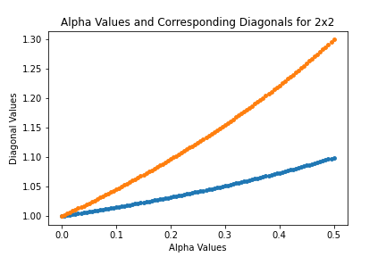
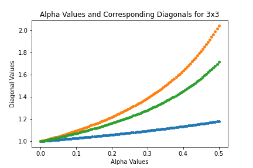
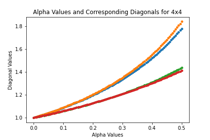
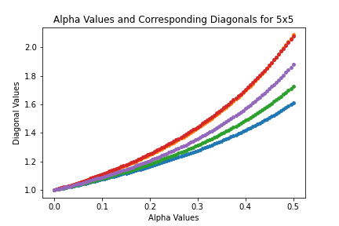
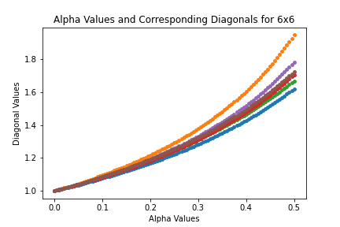
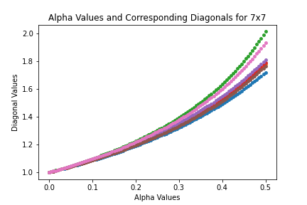

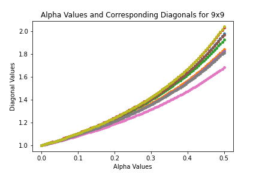
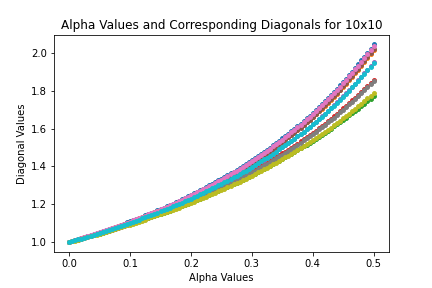
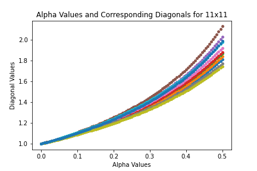
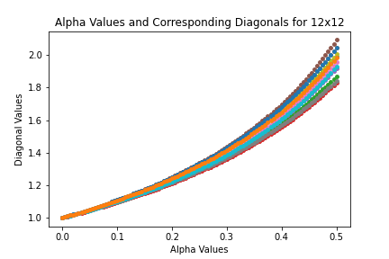
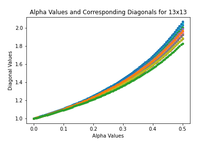
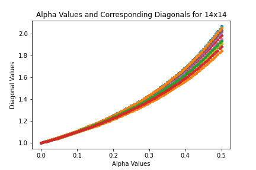
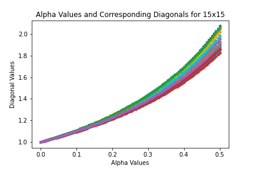

### View the code
[View the Matlab script used to generate the results](initial_findings.m)

[View the Python script used to graph and analyze the results](displaying_initial_results.py)