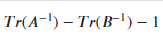

### Why a Symmetric Matrix Will Always Have an Increasing Derivative for its Inverse Diagonal Entries

For this section, assume A(t) is a symmetric row stochastic diagonally dominant matrix. B(t) is its principle sub-matrix which removes the first row and column. The eigenvalues of both matrices are real and positive because they are row diagonally dominant. Additionally, the eigenvalues of B(t) interlace with the eigenvalues of A(t) entry wise. This means that the largest eigenvalue of A(t) is larger than the largest of B(t). As well, the second-largest eigenvalue of A(t) is larger than the second largest of B(t). This continues on for every eigenvalue of A(t) and B(t). It can be expressed as such using lambda as eigenvalues of A(t) and mu for eigenvalues of B(t):

After inverting, the interlacing remains. This means that the inverse eigenvalues of A(t) are still greater than the inverse eigenvalues of B(t) entry wise. Since the trace of a matrix is just the sum of the eigenvalues, we know that the sum of the A(t) inverse eigenvalues will be greater than the sum of the B(t) inverse eigenvalues since each inverse eigenvalue of A(t) is greater entry wise than the inverse eigenvalues of B(t). Additionally, we know that the inverse eigenvalues of A(t) are all greater than one because the original eigenvalues are smaller than one. This means inequality for the sign of the derivative found below will always be positive. 

For further explanation of the inequality, view the section on [finding the derivative inequality.](inequality_findings.md)

### Navigate to Other Pages
[Go to the previous page: Viewing the inverse diagonal entries using eigenvalues](eigenvalue_findings.md)

[Go to the next page: Viewing the derivative inequality](inequality_findings.md)

[Return to the home page](README.md)

[View definitions of symbols used in the project](definitions.md)

